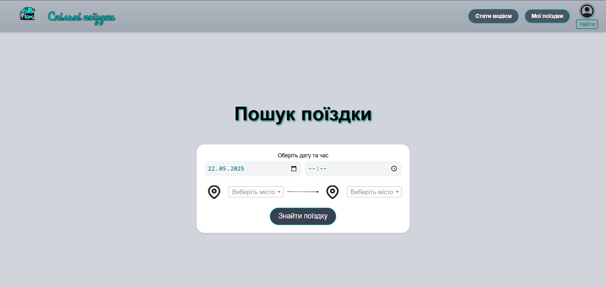
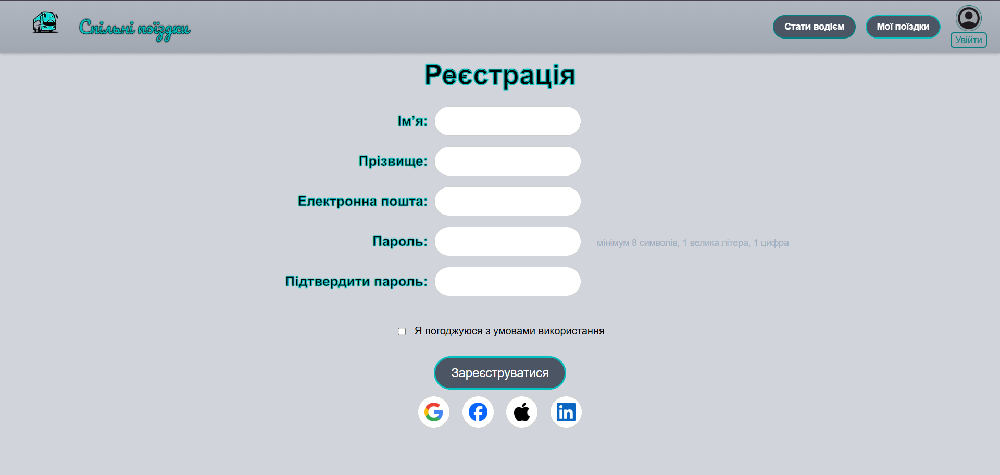
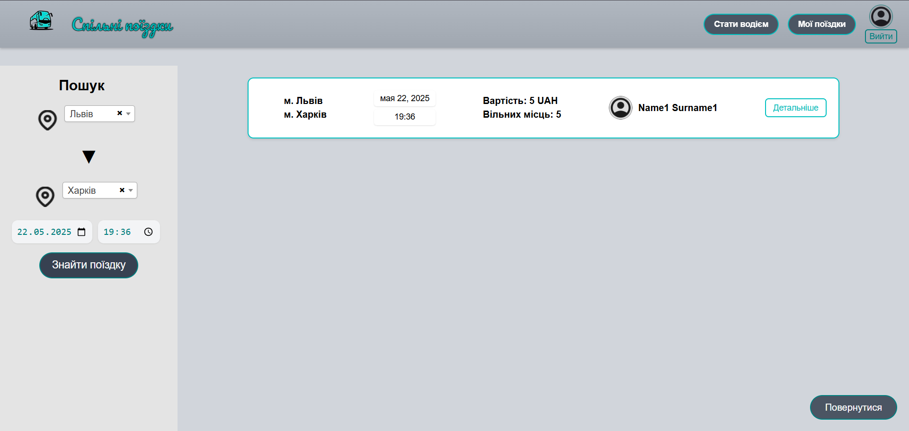

# Система спільних поїздок (OOP Project)

Курсовий проєкт з об’єктно-орієнтованого програмування (ХАІ, група 623П). Веб-застосунок для спільних поїздок.

## Опис

Застосунок дозволяє:
- **Пасажирам**: шукати поїздки, бронювати місця, залишати відгуки.
- **Водіям**: створювати та редагувати поїздки, підтверджувати запити.
- **Обох**: авторизуватися з хешуванням паролів (BCrypt).

**Технології**:
- C#, ASP.NET Core MVC
- Razor, jQuery, Bootstrap
- JSON (`users.json`, `trips.json`, `reviews.json`)
- xUnit, Figma, GitHub

Використано ООП: інкапсуляція, спадкування, поліморфізм, інтерфейси, делегати, принципи SOLID, LINQ, Generic Collections.

## Як запустити

### Вимоги
- Visual Studio 2022
- .NET 6.0+
- Git
- NuGet: `BCrypt.Net`, `Newtonsoft.Json`

### Кроки
1. Клонувати:
   git clone https://github.com/kirilvolkov47/OOP_ProjectVolkov.git
2. Відкрити OOP_ProjectVolkov.sln у Visual Studio.
3. Встановити пакети:
Install-Package BCrypt.Net
Install-Package Newtonsoft.Json
4. Запустити: F5

Демо: 

## Контакти
Кіріл Волков, ХАІ, 623П.
Email: linknameonly@gmail.com, k.r.volkov@student.khai.edu
